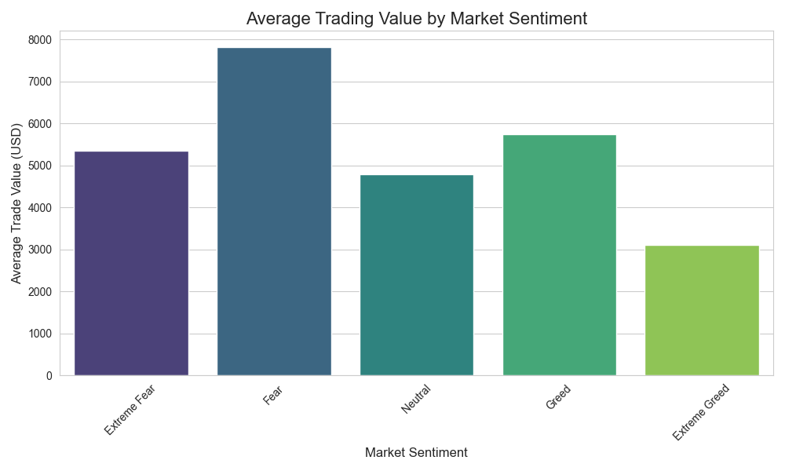

# Quantitative Trading Behavior Analysis: A Sentiment-Driven Case Study


---

## **Overview**  

This project performs a **quantitative analysis** of cryptocurrency trading performance, examining how **market sentiment** influences **profitability, trade size, and risk exposure**.  

By merging **personal trading history** with the **Crypto Fear & Greed Index**, the analysis reveals how behavioral biases affect trading decisions and outcomes under different psychological market states.

> **Objective** → To identify patterns in trading behavior and optimize strategy based on market psychology.

---

## **Key Insights & Findings**

### **1. Profitability Trends** 💰
- Highest **average PnL** occurred during **Extreme Greed** → **+$67.89** per trade.
- Lowest PnL recorded during **Neutral** sentiment → **+$34.30** per trade.
- **Insight** → Strategy performs best during bullish momentum phases.

---

### **2. Risk Exposure** 📉
- Average trade size peaked during **Fear** (~$7,816), lowest during **Extreme Greed** (~$3,112).
- Indicates a **“buy-the-dip” bias**: larger capital deployment during pessimistic sentiment.
- Higher PnL volatility observed during **Fear** and **Extreme Greed** → risk increases during market extremes.

---

### **3. Trade Direction Analysis** 📊
- Evaluated **Buy (Long)** vs **Sell (Short)** profitability under each sentiment phase.
- Identified the optimal **trade direction** depending on sentiment-driven market dynamics.

---

### **4. Volatility Mapping** ⚡
- Calculated **PnL standard deviation** by sentiment category.
- Discovered that trades executed during **Extreme Fear** had the highest unpredictability.

---

## **Technical Stack** 🛠️  

- **Language** → Python 3.10+  
- **Data Manipulation** → Pandas, NumPy  
- **Visualization** → Matplotlib, Seaborn  
- **Environment** → Jupyter Notebook / Google Colab  
- **Data Sources** →  
  - Personal Trading Ledger (`trades.csv`)  
  - Crypto Fear & Greed Index (`sentiment.csv`)  

---

## **Methodology** 🔍 

### **Step 1 — Data Ingestion**
- Loaded trading history and sentiment data.  

### **Step 2 — Data Cleaning & Preprocessing**
- Standardized date formats via `pd.to_datetime`.  
- Renamed columns for clarity (`Closed PnL` → `PnL`).  

### **Step 3 — Data Merging**
- Performed a **left join** on **trade date** to map sentiment to each trade.

### **Step 4 — Exploratory Data Analysis (EDA)**
- Grouped data by **Sentiment** to compute:  
  - Mean PnL  
  - Average trade size  
  - Trade frequency  
  - PnL volatility (std deviation)  

### **Step 5 — Visualization**
- Designed **insight-driven plots** to showcase relationships between sentiment, profitability, and behavior.

---

## **Key Visualizations**

### **PnL Distribution by Sentiment**


### **Average PnL by Sentiment**


### **Trade Size vs. Sentiment**


---

## **How to Run This Project**

```bash
# Clone the repository
https://github.com/waheed24-03/Quantitative-Trading-Behavior-Analysis

# Install dependencies
pip install pandas matplotlib seaborn jupyterlab

# Place datasets in the root directory
csv_files/trades.csv
csv_files/sentiment.csv

# Launch Jupyter Notebook
jupyter lab

```
---


